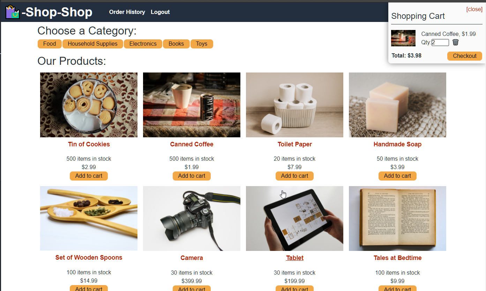
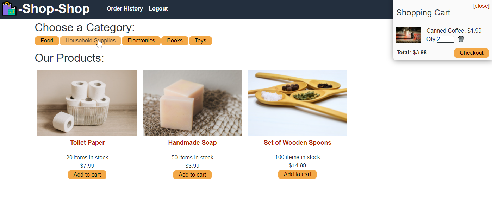
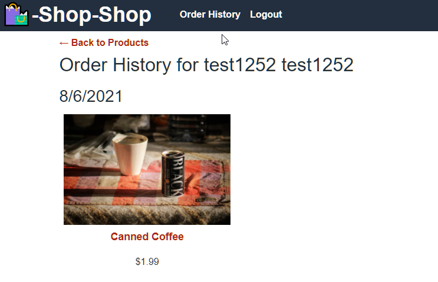
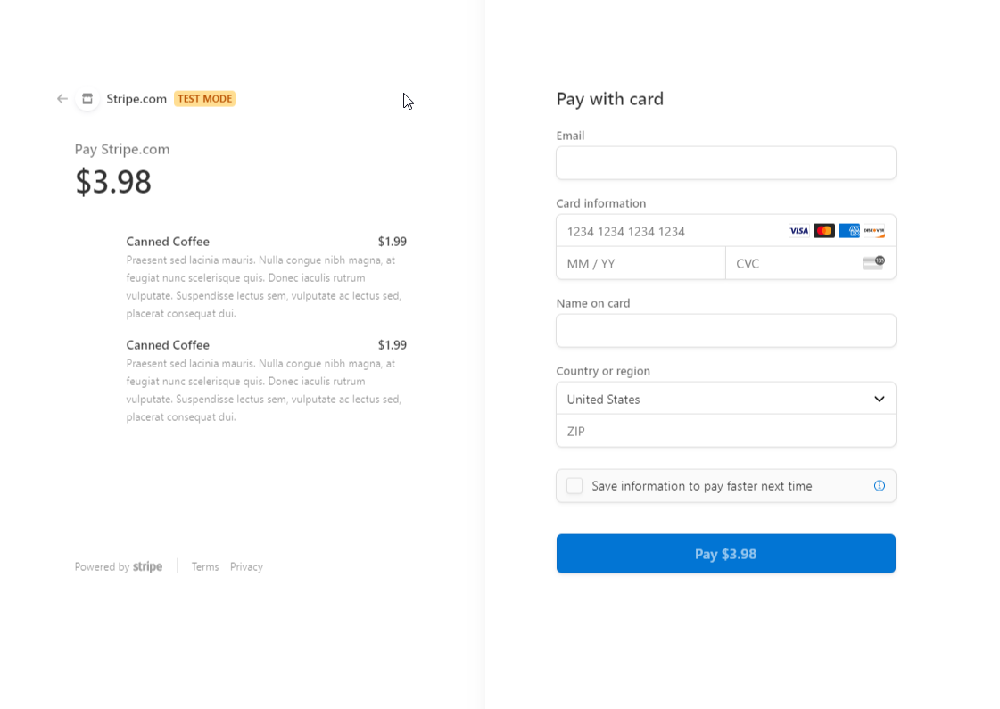

 # Shop-Shop 

  ## About/Description

  Shop-Shop is an e-commerce application.  This React application uses Redux to manage global state to allow users to add and remove items to their cart.  Users must log into the application to purchase items and Stripe.js handles the payment of items. This application is deployed to Heroku and MongoDB handles the database of the application with GraphQL API routes.

  ## Table of Contents

  * [Installation](#installation)
  * [Usage](#usage)
  * [Languages](#languages)
  * [Contributing](#contributing)
  * [License](#license)
  * [Tests](#tests)
  * [Questions](#questions)
  
  ## Installation

  No special installation instructions

  ## Usage

  ### Screenshots

  #### Homepage of logged in user with items added to cart

  

  #### Category selection narrows down items

  

  #### User past order history

  

  #### Stripe.js handles the checkout purchasing of items

  

  ## Languages

  React Redux Heroku MongoDB Stripe.js JavaScript ES6 jQuery

  ## Contributing

  Contributions by: David Shaw,  starter code provided by Bootcamp

  If you would like to contribute to this project we follow the [Contributor Covenant](https://www.contributor-covenant.org/)

  ## License

  https://choosealicense.com/licenses/mit/

  ## Tests

  Tests setup with React tests

  ## Questions:

  If you have any questions please contact us or refer to our github below:

  Email Us At: david.shaw1242@gmail.com

  Github Repo: https://github.com/ds1242/shop-shop